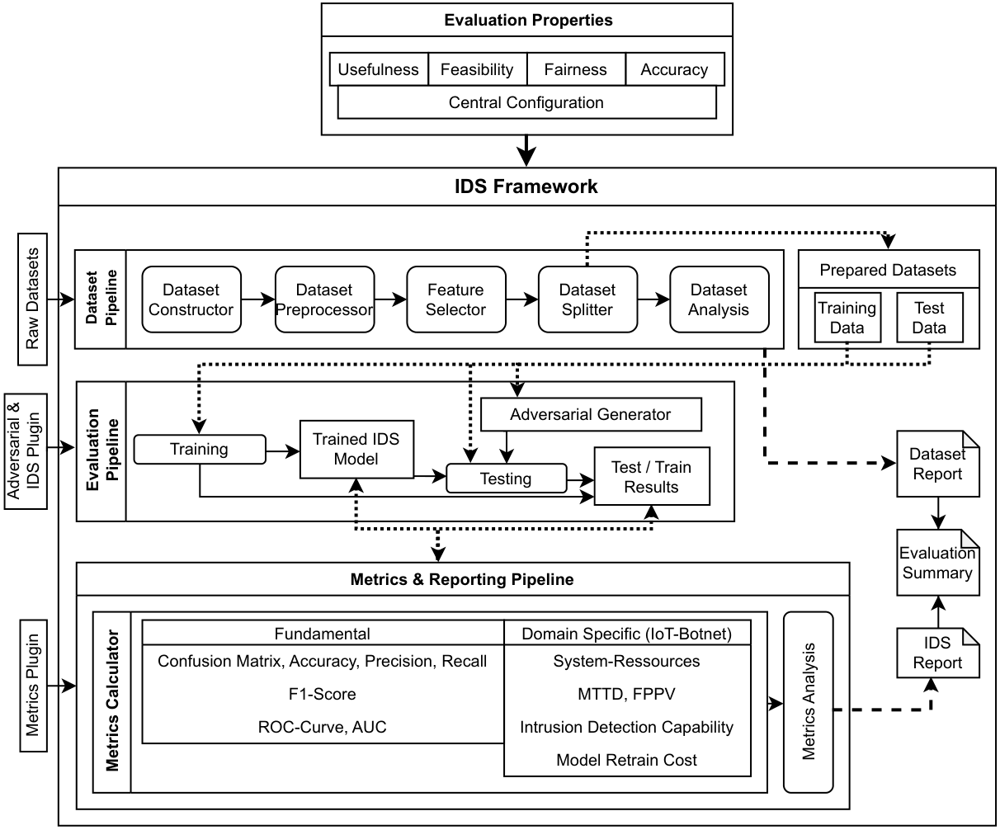

# IDS Evaluation Framework

A comprehensive, modular, and configurable framework for evaluating Machine Learning-based Intrusion Detection Systems (IDS).



- [IDS Evaluation Framework](#ids-evaluation-framework)
  - [Features](#features)
  - [Installation](#installation)
    - [Prerequisites](#prerequisites)
    - [Native Installation](#native-installation)
    - [Docker Installation](#docker-installation)
  - [Quick Start](#quick-start)
    - [1. Create a Configuration File](#1-create-a-configuration-file)
    - [2. Prepare Your Data](#2-prepare-your-data)
    - [3. Run Evaluation](#3-run-evaluation)
  - [Usage](#usage)
    - [CLI Commands](#cli-commands)
    - [Evaluation Flags](#evaluation-flags)
    - [Makefile Targets](#makefile-targets)
  - [Configuration](#configuration)
    - [Key Configuration Sections](#key-configuration-sections)
  - [Output Structure](#output-structure)
  - [Plugin Development](#plugin-development)
  - [Development](#development)
  - [License](#license)

## Features

- **Modular Plugin Architecture**: Easily extend the framework with custom IDS models, metrics, and adversarial attacks
- **Flexible Data Pipeline**: Load, preprocess, and split datasets with configurable preprocessing steps and feature selection
- **Multiple Evaluation Modes**: Support for intra-dataset, cross-dataset, and k-fold cross-validation evaluation
- **Comprehensive Metrics**: Built-in static metrics (accuracy, F1, precision, recall, ROC-AUC, etc.) and runtime metrics (CPU, RAM, training time)
- **Adversarial Robustness Testing**: Evaluate model robustness against adversarial attacks (FGSM, noise perturbation, junk data injection)
- **Reproducible Results**: Hash-based output organization ensures consistent experiment tracking
- **Flexible Deployment**: Run natively with Python or via Docker

## Installation

### Prerequisites

- Python 3.13+
- [uv](https://docs.astral.sh/uv/getting-started/installation/) (recommended) or pip

### Native Installation

```bash
# Install dependencies (uv should be in your $PATH)
uv sync

# Verify installation
uv run ids-eval version
```

### Docker Installation

* Official Docker Images (stable releases): https://hub.docker.com/r/niklassandhu/ids-eval-framework
* Currently supported architectures for docker images are: arm64 (Raspberry Pi, Apple Silicon, ...), amd64 (AMD, Intel)


```bash
# Configure environment variables
cp .env.example .env
# Edit .env to set your data paths

# Run via Docker Compose
docker compose run --rm ids-eval version
```

A pre-built Docker image is available on Docker Hub: `niklassandhu/ids-eval-framework:latest`

## Quick Start

### 1. Create a Configuration File

Copy the example configuration and adjust it to your needs:

```bash
cp run_config/example.config.yml run_config/my_config.yml
```

### 2. Prepare Your Data

Run the data preparation pipeline:

```bash
uv run ids-eval dataset <run_config>
```

### 3. Run Evaluation

Execute the evaluation pipeline:

```bash
uv run ids-eval evaluate <run_config>
```

## Usage

### CLI Commands

The framework provides two main commands:

| Command | Description                |
|---------|----------------------------|
| `ids-eval dataset <config.yml>` | Run dataset pipeline       |
| `ids-eval evaluate <config.yml>` | Run evaluation pipeline |

### Evaluation Flags

| Flag                  | Description |
|-----------------------|-------------|
| `--train-only`        | Only train models, skip testing phase |
| `--force-train`       | Force retraining, ignore saved models |
| `--force-model`       | Load saved models without config hash validation |
| `--clear-checkpoints` | Clear evaluation checkpoints before running |

### Makefile Targets

```bash
make dataset CONFIG=<config.yml>          # Run dataset pipeline
make evaluate CONFIG=<config.yml>         # Run evaluation pipeline
make docker-dataset CONFIG=<config.yml>   # Run dataset pipeline via Docker
make docker-evaluate CONFIG=<config.yml>  # Run evaluation via Docker
make help                                 # Show all available targets
```

## Configuration

The framework uses YAML configuration files. See `run_config/example.config.yml` for a fully documented example.

### Key Configuration Sections

- **general**: Run name, paths, random seed
- **data_manager**: Dataset loading, preprocessing, feature selection, train/test split
- **evaluation**: IDS models, metrics, adversarial attacks

## Output Structure

All outputs are organized in hash-based directories for reproducibility:

```
out/
├── processed_datasets/<hash>/    # Preprocessed datasets
├── saved_models/<hash>/          # Trained models
└── reports/<hash>/               # Evaluation reports
    ├── config.yaml               # Configuration used
    ├── dataset_report.yaml       # Dataset statistics
    ├── ids_report.yaml           # Detailed evaluation results
    └── evaluation_summary.yaml   # Aggregated summary
```

The configuration hash is displayed at startup:
```
Your config hash is: a1b2c3d4
```

## Plugin Development

The framework supports four types of plugins:

| Plugin Type | Directory | Base Class |
|-------------|-----------|------------|
| IDS Models | `plugin_ids/` | `AbstractIDSConnector` |
| Static Metrics | `plugin_static_metric/` | `AbstractStaticMetric` |
| Runtime Metrics | `plugin_runtime_metric/` | `AbstractRuntimeMetric` |
| Adversarial Attacks | `plugin_adversarial/` | `AbstractAdversarialAttack` |

See the existing plugins in each directory for implementation examples.

## Development

```bash
make setup      # Install dependencies
make test       # Run tests
make lint       # Check code style
make format     # Format code
```

## BibTeX entry
Please cite this project using the following bibtex entry:
[](https://shields.io/)

## License

See [LICENSE](LICENSE) for details.
